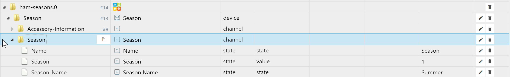

# ioBroker Seasons adapter based on homebridge-template
=================

## Template homebridge plugin adapter

After the renaming from [this](https://github.com/ioBroker/ioBroker.template#steps) is executed,
you can update package.json with "dependencies" write valid name and version of homebridge module.

And then extend the config for homebridge in io-package.json at "wrapperConfig".

Last step is to write valid index_m.html for this driver.

## Description
This adapter is based on homebridge-template plugin.

Read more about it here https://www.npmjs.com/package/homebridge-template

## Changelog

### 0.0.1 (@@date@@)
* (@@Author@@) initial commit

## License
The MIT License (MIT)

Copyright (c) 2018 @@Author@@ <@@email@@>

Permission is hereby granted, free of charge, to any person obtaining a copy
of this software and associated documentation files (the "Software"), to deal
in the Software without restriction, including without limitation the rights
to use, copy, modify, merge, publish, distribute, sublicense, and/or sell
copies of the Software, and to permit persons to whom the Software is
furnished to do so, subject to the following conditions:

The above copyright notice and this permission notice shall be included in
all copies or substantial portions of the Software.

THE SOFTWARE IS PROVIDED "AS IS", WITHOUT WARRANTY OF ANY KIND, EXPRESS OR
IMPLIED, INCLUDING BUT NOT LIMITED TO THE WARRANTIES OF MERCHANTABILITY,
FITNESS FOR A PARTICULAR PURPOSE AND NONINFRINGEMENT. IN NO EVENT SHALL THE
AUTHORS OR COPYRIGHT HOLDERS BE LIABLE FOR ANY CLAIM, DAMAGES OR OTHER
LIABILITY, WHETHER IN AN ACTION OF CONTRACT, TORT OR OTHERWISE, ARISING FROM,
OUT OF OR IN CONNECTION WITH THE SOFTWARE OR THE USE OR OTHER DEALINGS IN
THE SOFTWARE.
